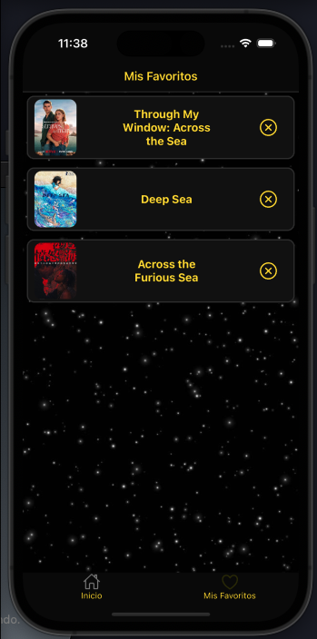
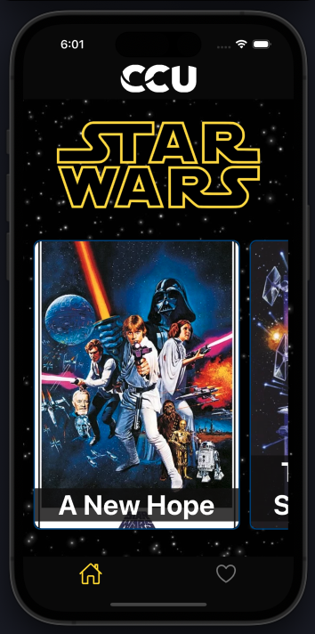
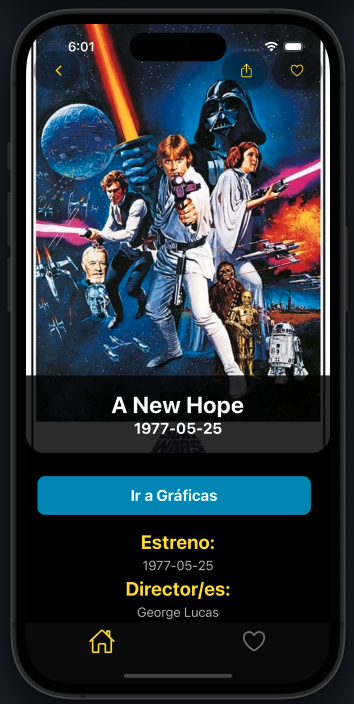
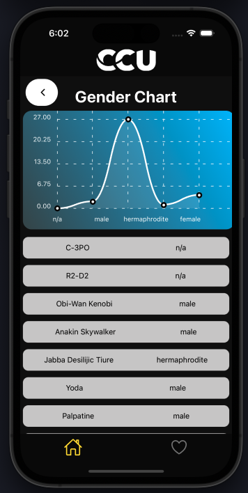

# DarkSide - App

DarkSide - App es una aplicación móvil desarrollada en React Native para Adentrarnos en el mundo de Star Wars

## Funcionalidades de DarkSide - App

DarkSide - App ofrece a los usuarios una experiencia inmersiva en el mundo de Star Wars, con una variedad de características emocionantes:

### 1. Información de Películas de Star Wars
Los usuarios podrán explorar información detallada sobre todas las películas de Star Wars, incluyendo detalles de la trama, fecha de lanzamiento y más.

### 2. Gráficos de Personajes y Géneros
La aplicación presenta gráficos interactivos que muestran información sobre los personajes de Star Wars y sus respectivos géneros. Esto proporciona una visión general visual de la distribución de géneros entre los personajes.

### 3. Visualización de Posters
Los usuarios tendrán acceso al posters de las películas de Star Wars. 

### 4. Funcionalidad de Favoritos
DarkSide - App permite a los usuarios agregar películas y personajes favoritos a una lista especial. Esto facilita el acceso rápido a los contenidos favoritos del usuario.

### 5. Compartir en Redes Sociales y Correo Electrónico
Los usuarios podrán compartir información sobre películas específicas, personajes o cualquier otro contenido de la aplicación a través de redes sociales como Facebook, Twitter, Instagram, así como también por correo electrónico. Esto permite a los usuarios compartir su pasión por Star Wars con amigos y seguidores.

Con estas características, DarkSide - App brinda a los fanáticos de Star Wars una plataforma completa para explorar, disfrutar y compartir su amor por esta icónica saga cinematográfica.

## Librerías utilizadas

### React
React es una biblioteca de JavaScript para construir interfaces de usuario.

### Redux
Redux es una librería para el manejo del estado de la aplicación en aplicaciones JavaScript.

### React Navigation
React Navigation es una librería de navegación para React Native que permite la navegación entre pantallas en la aplicación.

### Axios
Axios es un cliente HTTP basado en promesas para el navegador y Node.js.

### Redux Toolkit
Redux Toolkit es un conjunto de herramientas de Redux que facilita la escritura de código Redux más limpio y eficiente.

### React-Chart-Kit
React Chart Kit Es una libreria para mostrar Charts en la aplicación

### React Toast Message
React Toast Message es una librería para mostrar mensajes emergentes en la aplicación.

## Estructura del proyecto

DarkSide - App utiliza Atomic Design para organizar sus componentes.

- **Atoms**: Componentes más básicos y simples.
- **Molecules**: Componentes que combinan varios átomos.
- **Organisms**: Componentes más complejos que pueden incluir múltiples moléculas y átomos.
- **Pages**: Páginas de la aplicación que combinan varios templates y organismos.

## Pasos para ejecutar

1. Clona el repositorio desde.
2. Navega al directorio del proyecto.
3. Ejecuta `yarn install` o `npm install` para instalar las dependencias.
4. Ejecuta `yarn start` o `npm start`.
5. Selecciona el sistema operativo (iOS o Android) para iniciar la aplicación.

